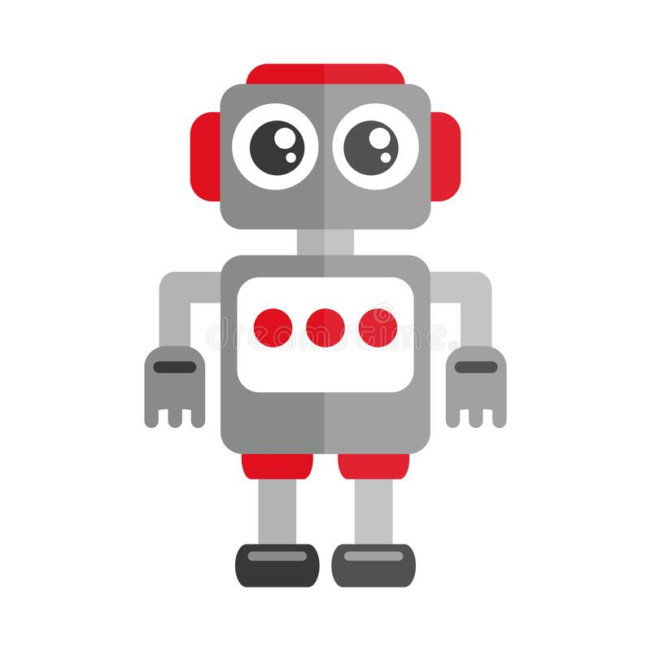

# Toy Robot!



The application is a simulation of a toy robot moving on a square tabletop, of dimensions 5 units x 5 units.

## How to run

**its necessary that you have Nodejs Version v16.14.2+ to run the cli or web.**

### Web
```shell
cd ./toy-robot-web
npm install
npm run dev
```

### CLI
```shell
cd ./toy-robot-cli
npm install
npm run dev
```


## How to operate the robot

- PLACE X,Y,F - Place the toy robot on the table in position X,Y and facing (NORTH, SOUTH, EAST or WEST).
- MOVE - Move the toy robot one unit forward in the direction it is currently facing.
- LEFT - Rotate the toy robot 90 degrees to the left without changing the position of the robot.
- RIGHT - Rotate the toy robot 90 degrees to the right without changing the position of the robot.
- REPORT - Report the position of the toy robot as X,Y,F. (only available for cli)
- EXIT - Exit the application. (only available for cli)